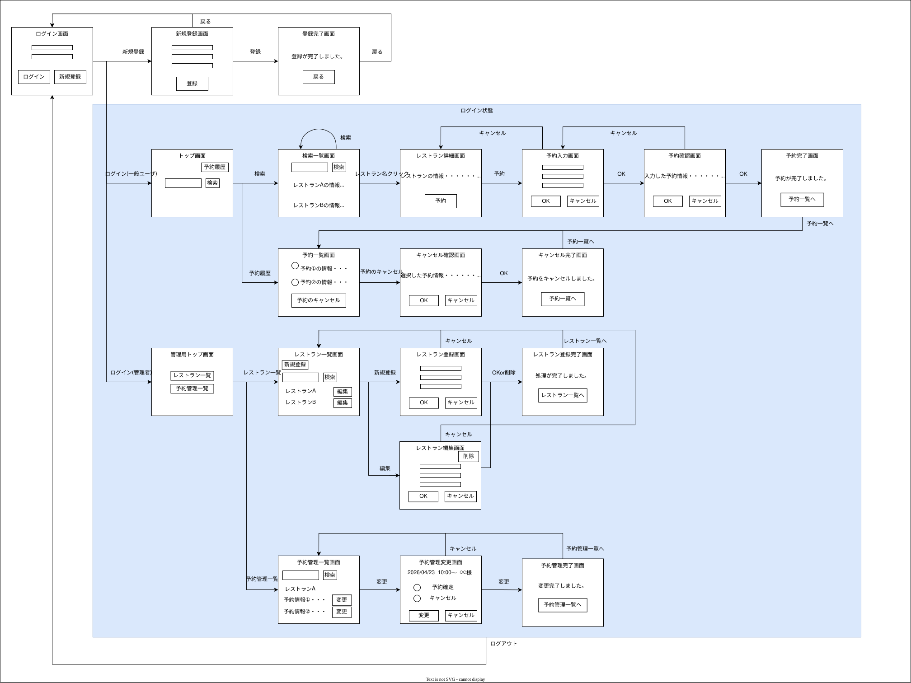
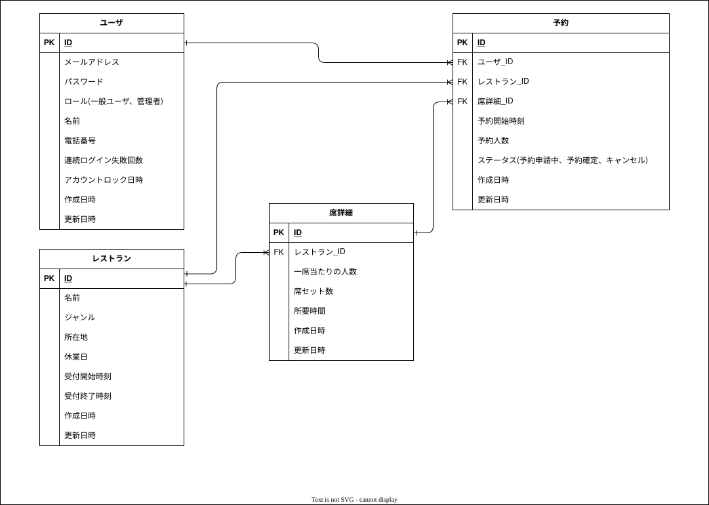

# レストラン予約管理システム

Spring Boot を用いて構築したレストラン予約管理システムです。  
ユーザーによる予約と、管理者によるレストラン・予約管理の両機能を備えています。   
テスト設計書の作成からテストコードの実装、GitHub Actions による CI の導入まで行っています。

## デモ

> 🔗 デモURL：https://restaurant-reservation-ie78.onrender.com/

デモ用のログイン情報は職務経歴書に記載

---

## このアプリを作った理由

前職では Java を用いた開発経験がありましたが、Spring Boot には触れていませんでした。  
Java の経験を活かしながら現代的なフレームワークを学ぶため、また、ブランク期間を経た現在の技術力を客観的に示すために、CRUD操作を含めた本システムを制作しました。
あわせて、テスト設計・実装・CI 導入にも取り組み、開発品質への意識も示せるよう努めました。

---

## 機能一覧

### ユーザー機能
- 新規会員登録・ログイン／ログアウト
- レストラン一覧・詳細表示
- 空席確認・予約申し込み
- 予約履歴の確認・キャンセル

### 管理者機能
- レストランの登録・編集・削除
- 席種別（人数・席数・利用時間）の複数登録・編集
- 定休日の登録・管理
- 予約一覧の確認・管理

---

## 技術スタック

| 役割 | 技術                              |
|---|---------------------------------|
| バックエンド | Spring Boot 3.5.13              |
| フロントエンド | Thymeleaf / Bootstrap 5         |
| データベース | PostgreSQL 17                   |
| 認証 | Spring Security                 |
| ORM | Spring Data JPA                 |
| ビルドツール | Gradle                          |
| 開発環境 | IntelliJ IDEA / JDK 21          |
| その他 | Lombok / Validation / flatpickr |

---

## システム構成

```
ブラウザ
  ↓ HTTP
Controller（Spring MVC）
  ↓
Service（ビジネスロジック）
  ↓
Repository（Spring Data JPA）
  ↓
PostgreSQL
```

---

## 設計・開発プロセス

実装に入る前に、画面遷移図と ER 図を作成して全体設計を行いました。事前設計により、実装中の手戻りを最小限に抑えることができました。

### 画面遷移図


### ER図


---

## テスト

### テスト構成
| 対象メソッド | 件数 | 手法 |
|---|---|---|
| `canReception`（受付時間チェック） | 25件 | 同値分割・境界値分析・デシジョンテーブル |
| `isPastDate`（過去日時チェック） | 5件 | 同値分割・境界値分析 |
| `isHoliday`（定休日チェック） | 3件 | 同値分割 |
| `saveReservation`（予約登録） | 5件 | モックを用いた単体テスト |

### 使用技術
- **JUnit 5**：`@ParameterizedTest` / `@MethodSource` によるパラメータ化テスト
- **Mockito**：`@Mock` / `@Spy` / `@InjectMocks` によるモック化
- **GitHub Actions**：main ブランチへの push・PR をトリガーにテストを自動実行し、テストレポートを出力

---

## 工夫した点

### テスト設計を意識した実装
テストコードを書く前にテスト設計書を作成し、同値分割・境界値分析・デシジョンテーブルを用いてテストケースを洗い出しました。
また、テスタビリティを意識した設計として、日時取得に Clock を導入し、テスト時に任意の日時を注入できるようにしています。

### レイヤーの役割分担を意識した設計
Controller・Service・Repository それぞれの役割に沿った実装を意識しました。  
ビジネスロジックは Service に集約し、Controller は受け取ったリクエストを Service に委譲するだけのシンプルな構成にしています。

### Javadoc・コメントによる可読性の向上
チーム開発を意識し、クラスやメソッドに Javadoc を付与しました。  
処理の意図が伝わるよう適切にコメントを記載することで、第三者が読んでも理解しやすいコードを心がけました。

### 予約登録時の4つのチェック
予約登録時に必要なチェックを検討し、不要なデータの登録や予約の重複が起こらないようにしました。

1. 過去日時チェック
2. 定休日チェック
3. 受付時間チェック
4. 重複予約チェック

---

## セットアップ手順

### 前提条件
- JDK 21
- PostgreSQL 17
- Gradle

### 手順

**1. リポジトリをクローン**
```bash
git clone https://github.com/hrdhrk07-spec/restaurant-reservation.git
```

**2. データベースを作成**
```sql
CREATE DATABASE restaurant_reservation;
```

**3. 環境変数を設定**

本アプリの実行には環境変数を設定する必要があります。  
以下はIntelliJ IDEAでの設定例です。  
構成の編集 → 新規構成の追加 → Spring Bootで構成を作成し、オプションに以下を設定してください。

```
名前：（任意）
モジュール：Java 21
メインモジュール：restaurant-reservation.main
環境変数（※「オプションを変更」から環境変数を選択して入力欄を表示）
DB_URL=jdbc:postgresql://localhost:5432/restaurant_reservation
DB_USERNAME=（PostgreSQLのユーザー名）
DB_PASSWORD=（PostgreSQLのパスワード）
```

**4. アプリケーションを起動**

IntelliJを用いる場合は先ほどの構成で実行してください。コマンドを用いる場合は以下を実行してください。

```bash
./gradlew bootRun
```

**5. ブラウザでアクセス**
```
http://localhost:8080
```

---

